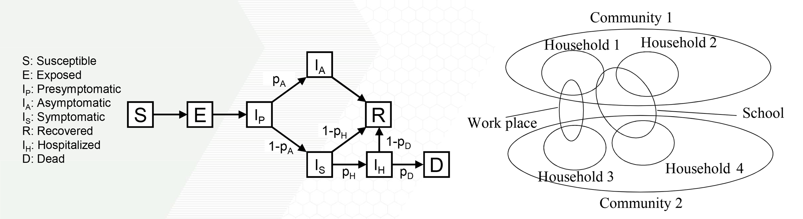
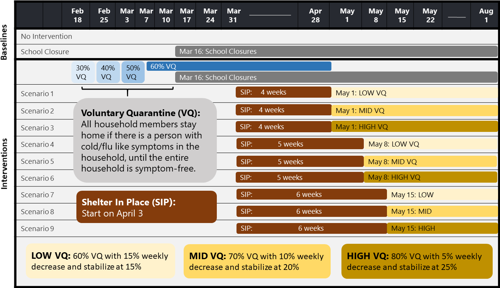
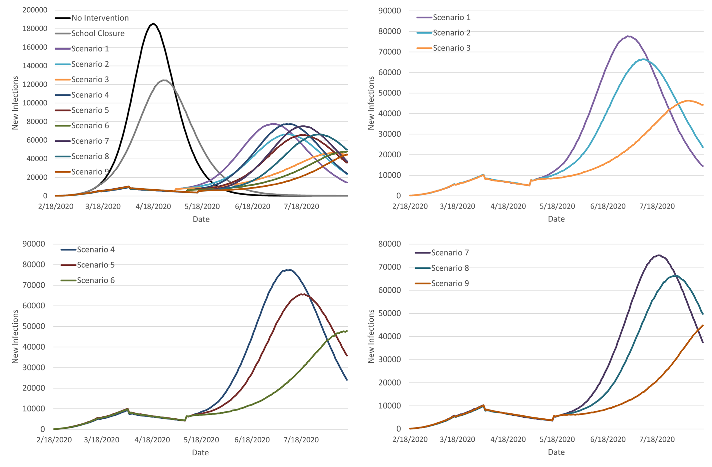
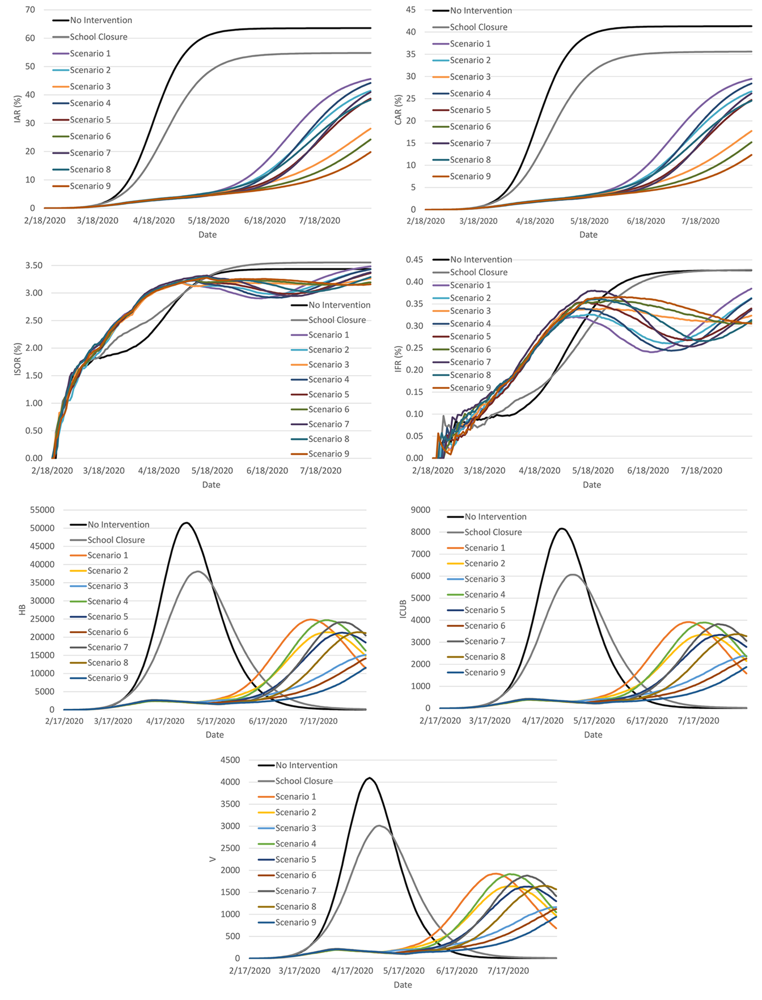
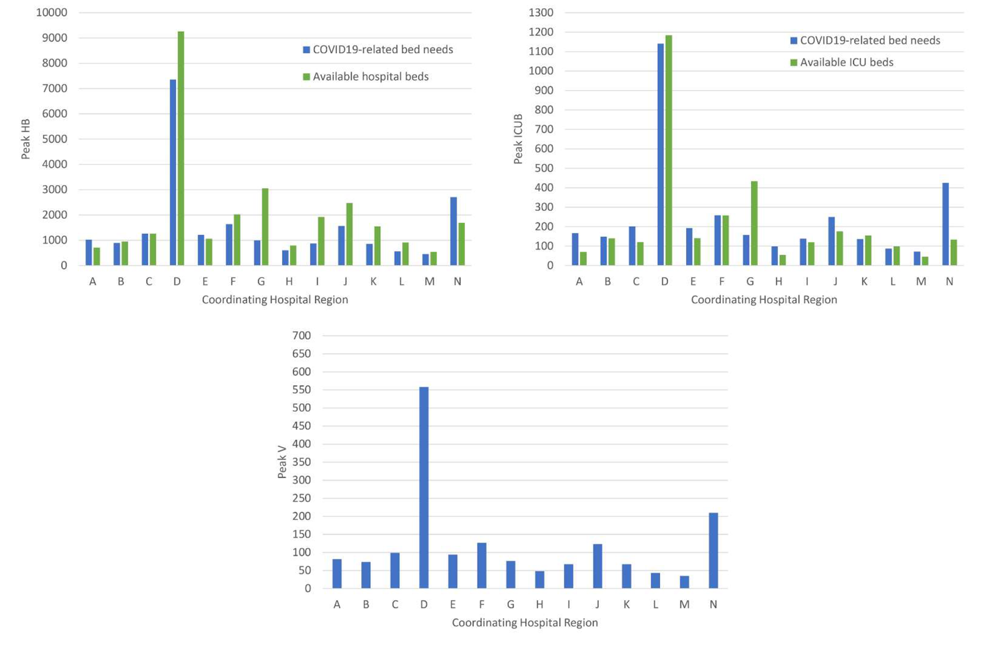
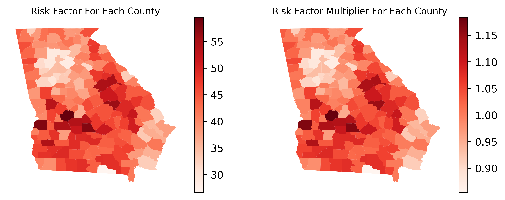
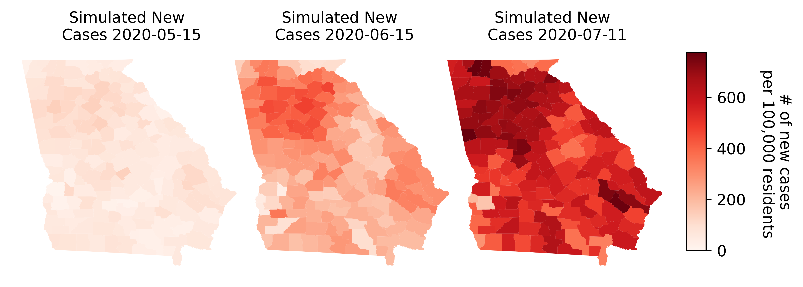

# The Impact of Social Distancing on COVID19 Spread: State of Georgia Case Study

This repository functions as a central location for the data used in our study as well as summary of our results from our manuscript "The Impact of Social Distancing on COVID19 Spread: State of Georgia Case Study". 
Our message is that shelter-in-place followed by voluntary quarantine could substantially reduce COVID19 infections, healthcare resource needs, and severe outcomes; delay the peak; and enable better preparedness. This is an important message as local and state officials across the United States face difficult decisions about when and how to transition to a “new normal.” The new normal we highlight is the need for policies and guidelines to ensure high compliance of voluntary quarantine.
The code for our model is not available for public use.

## Findings
Extending shelter-in-place by one week delays the peak by about 8 days but it does not significantly reduce the peak. High compliance with voluntary quarantine following shelter-in-place reduces the peak by 40% in Georgia.

## Design
We developed an agent-based simulation model to project the infection spread. We populated the model using COVID19-specific parameters for the natural history of the disease and data from Georgia on agents’ interactions and demographics. 

## Setting
The simulation study covered a six-month period, testing different social distancing scenarios, including baselines (no-intervention or school closure only) and combinations of shelter-in-place and voluntary quarantine with different timelines and compliance levels. The outcomes are compared at the state and community levels. Below are the descriptions for the intervention scenarios considered in this study along with their scenario number referred in the Results section of the [manuscript](/Manuscript/Community-level%20Covid-19%20Case%20Measurement%20and%20Intervention%20Version%201.pdf). 

## Main Outcomes
The number and percentage of cumulative and daily new and symptomatic and asymptomatic infections, hospitalizations, and deaths; COVID19-related demand for hospital beds, ICU beds, and ventilators. 

## Results 
The combined intervention of shelter-in-place followed by voluntary quarantine reduced peak infections from 180,000 under no intervention and 120,000 under school closure, respectively, to below 80,000, and delayed the peak from April to June or later.

Increasing shelter-in-place duration from four to five weeks yielded 3-14% and 4-6% decrease in cumulative infection and fatality rates, respectively. Regardless of the shelter-in-place duration, increasing voluntary quarantine compliance decreased daily new infections from almost 80,000 to 50,000, and decreased cumulative infection rate by 50%.  The total number of fatalities ranged from 6,150 to 17,900 under different scenarios. Peak infection date varied across scenarios and counties; on average, increasing shelter-in-place duration delayed the peak day by 7 days across counties. The peak percentage is similar across rural and urban counties. 

Region D is estimated to have the highest COVID19-related healthcare needs with 7,357 hospital beds, 1,141 ICU beds, and 558 ventilators. 

County-level risk factor (left) and its multiplier (right) derived by applying the principal component analysis on several factors known to impact a higher risk of complications and severe outcomes for COVID19 infections, including prevalence of asthma, diabetes, obesity, smoking, cardiovascular disease and chronic conditions in general. 

Three maps of Georgia at the county level recording the number of new cases per 100,000 people for May 15, 2020 (simulated data from our model), June 15, 2020 (simulated data), and July 11, 2020 (simulated data). 

## Conclusions and Relevance 
Shelter-in-place followed by voluntary quarantine substantially reduce COVID19 infections, healthcare resource needs, and severe outcomes; delay the peak; and enable better preparedness. Time of the peak is projected to vary across locations, enabling reallocation of health system capacity. 

### Data: 
Data used to generate all of plots and conclusions are provided in this [repository](/Data). 

### Figures: 
Figures used to generate all of plots and conclusions are provided in this [repository](/figures). 

### Cite the manuscript as:

Keskinocak P, Oruc BE, Baxter A, Asplund J, Serban N (2020) The impact of social distancing on COVID19 spread: State of Georgia case study. [Manuscript.](/Manuscript/Community-level%20Covid-19%20Case%20Measurement%20and%20Intervention%20Version%201.pdf)

### Additional Contributors: 

The authors of this paper are thankful to state representatives for sharing multiple data sources from the cases confirmed in Georgia to date. The authors are also thankful to Melody Shellman, Hannah Lin, Ethan Channel, Pravara Harati, Zhuoting April Yu, and Christopher Stone for supporting various parts of the projects.

### Sources of Funding and Support:

The research was supported by the William W. George and by the Virginia C. and Joseph C. Mello endowments at Georgia Tech.
